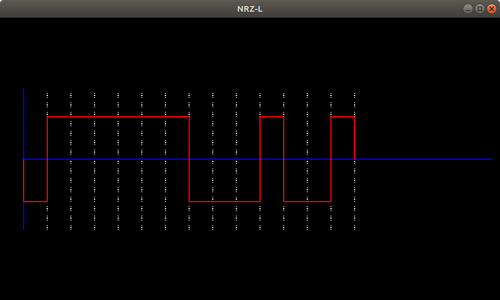
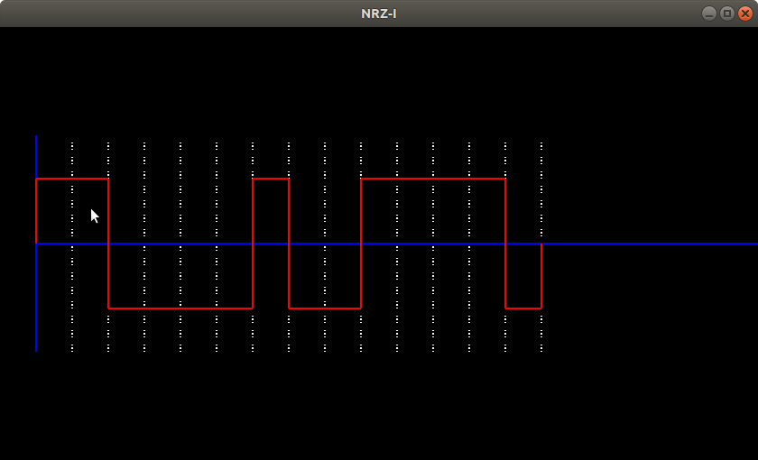
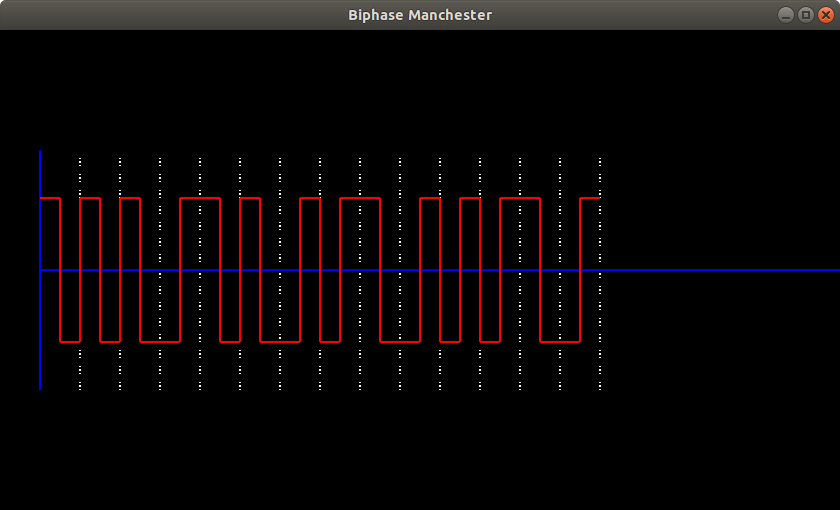
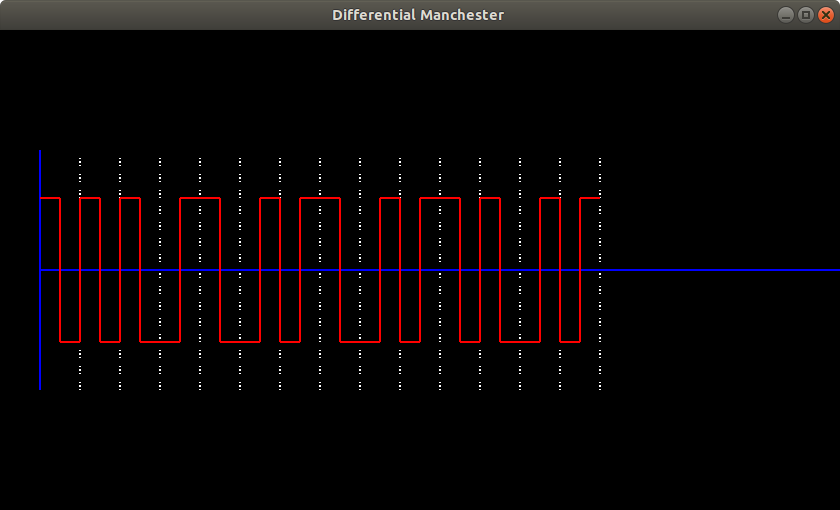
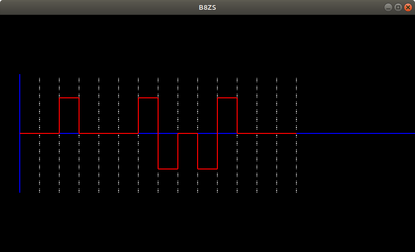
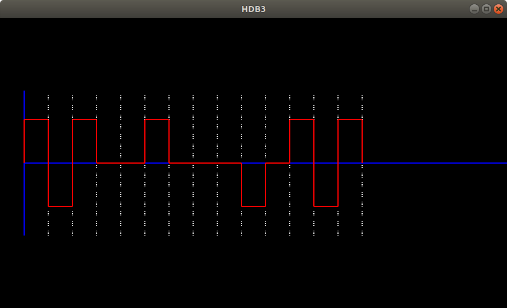

# Line-coding-scheme-using-OpenGL
In this, code itself generate a random input of digital data and gives the output according to the choosen scheme.
It also finds the longest palindrome in input.
Whole code is written in C++ programming language.
For more specifications see spec.pdf file.

Following are the output generated for different Digital Data Encoding schemes.

Encoding scheme - NRZ-L

Encoding scheme - NRZ-I

Encoding scheme - BIPHASE MANCHASTER

Encoding scheme - DIFFERENTIAL MANCHASTER

Encoding scheme - B8ZS

Encoding scheme - HDB3

